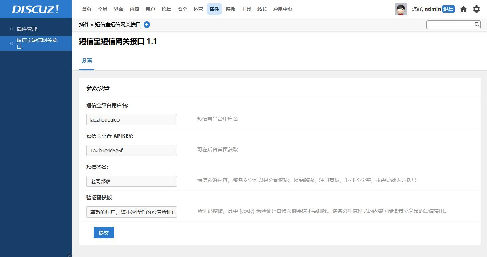
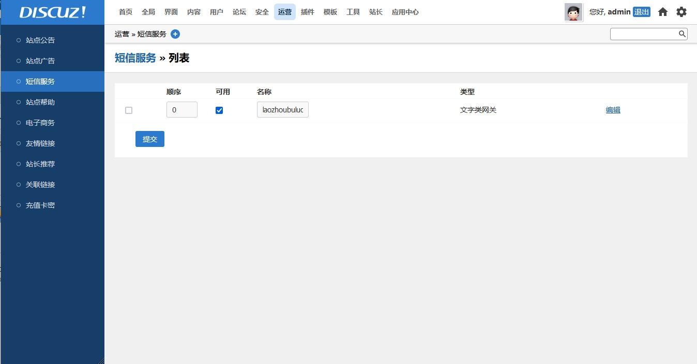
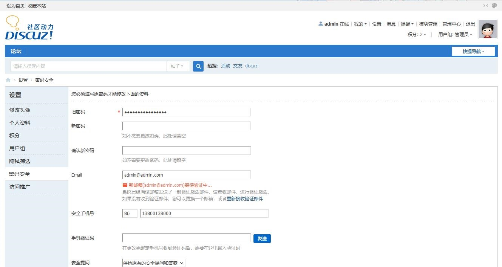
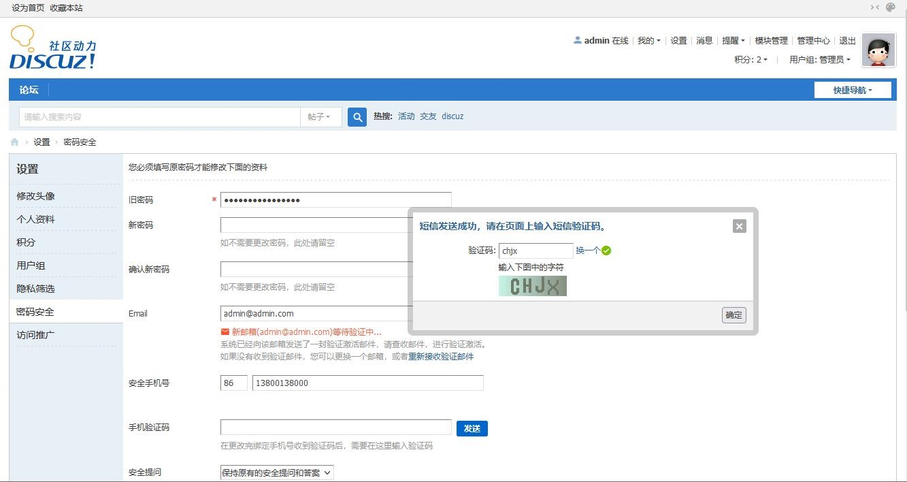
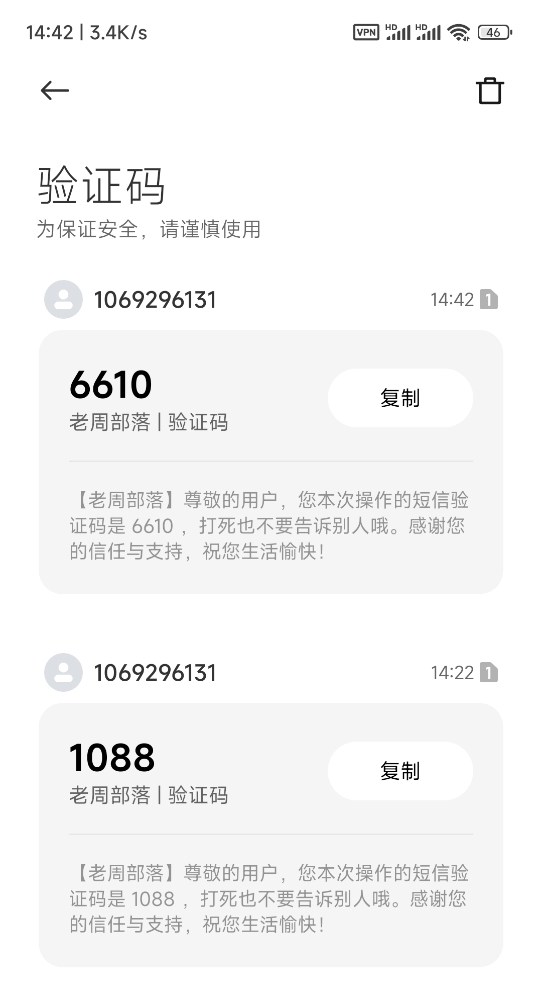

# 短信宝短信网关接口

## 应用介绍

**本插件用于简单演示 Discuz! X3.5 内置的短信功能。**

此处适配的为短信宝平台 (www.smsbao.com) 的 API 接口，在输入用户名以及系统生成的 APIKEY 之后即可使用该平台发送短信。

**该插件需要您自行注册短信宝平台后在短信宝平台获取 APIKEY ，随后正确在插件后台完成配置并在正式启用前在短信宝平台充值短信条数后才可以正常使用。**

## 版本支持
本插件仅支持 Discuz! X3.5 版本，具体可到 https://gitee.com/Discuz/DiscuzX/tree/v3.5/ 了解。

## 配置教程
1. 下载并安装插件。
2. 在插件配置中配置平台用户名，APIKEY，短信签名和验证码模板。
3. 在运营 » 短信服务 » 设置开启短信功能开关。
4. 在运营 » 短信服务 » 列表选项卡勾选 "laozhoubuluo_smsbao:短信宝短信网关接口" 可用状态，点击提交。
5. 后台更新缓存。
6. 测试时请不要忘记填写国际电话区号，中国大陆地区一般需要填写 86 至国际电话区号框（手机号左侧）。

## 法律声明
**短信宝平台上的内容及其描述或提供的产品与服务均不受本开发者的控制，也并不表示本开发者作出了某种认可、授权、赞助，或表明该平台属于本开发者的关联企业、合资企业、合作企业或业务伙伴，因此本开发者不对任何该平台及其上的内容、产品或服务（包括对第三方网站的进一步链接）负责，且本开发者不对短信宝平台服务的中断或终止而造成的任何损失向用户或任何第三方承担任何责任。**

## 开源信息
本插件使用 Apache 2.0 License 发布，并已经登录 GitHub 平台，地址为: https://github.com/laozhoubuluo/discuz_smsbao 。

如有任何问题，欢迎您通过 Issue 反馈，或通过 Pull Requests 进行改进。

也欢迎您通过 Star 鼓励我们继续开发类似产品。 

## 图片展示

